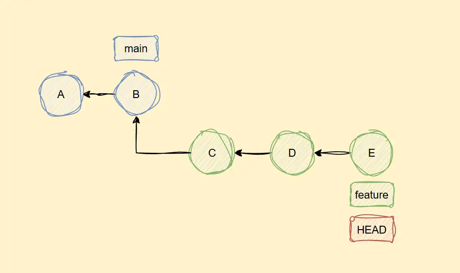
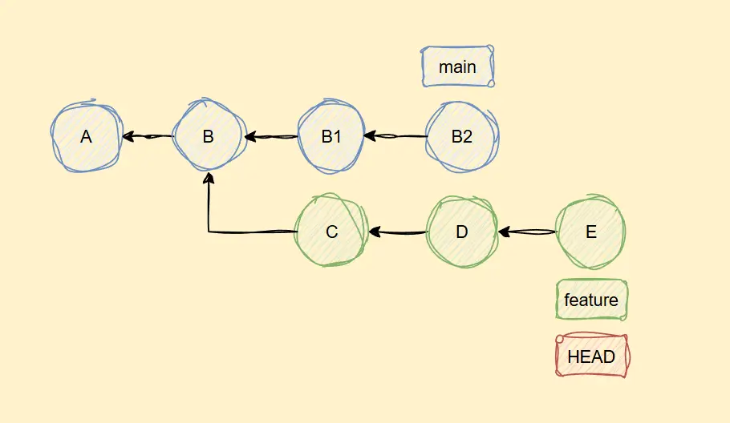

在多人协作开发中，如何妥善解决分支合并冲突往往是一个绕不开的坎，当然前提是使用 Git 作为版本管理工具。

还记得自己当初从远程仓库拉取代码失败时，当时有意识到出现了冲突，但是并不知道如何解决，只好先拷贝一下本地改动的文件，然后将本地工作目录重置到上次提交的状态，再重新拉取，最后将之前拷贝的改动再粘贴回去...

本文尝试整理一些分支合并时的细节问题和实践应用，便于自己后续回顾。

## 一次成功的合并

这里以将 feature 分支的改动合并到 main 分支为例，介绍几种常见的合并方式。

### 快进合并

参考下图这种情况，可以发现 main 分支的最新提交点（B）位于 feature 分支的直接上游处，那么此时合并 Git 只需要将 main 分支的最新提交点指向 feature 分支的最新提交点（E）即可，这种合并方式称为快进合并（fast-forward merge）。



快进合并的一个特点是合并后不会在提交历史上产生新的分叉节点，这种行为相当于执行了一次隐式合并，即无法从提交历史中看出这里存在过独立分支。如果需要保留原始分支的信息，可以在合并时添加 `--no-ff` 选项，这样 Git 会再生成一个新的合并节点，用于保留分支的分叉历史。

### 三路合并

在前面的快进合并中，我们发现 Git 只需要对比两个提交节点就可以确定合并后的内容。但有的时候，仅对比两个节点，并不能确定合并后的内容，比如下列这种情况：



此时 main 分支的最新提交点并不在 feature 分支的直接上游，想要完成合并，Git 需要对比以下三个提交节点：

1. main 分支的最新提交点，图中的 B2
2. feature 分支的最新提交点，图中的 E
3. 双方的最近公共祖先节点，图中的 B

这种合并方式称为三路合并（three-way merge）。

> [!NOTE] 为什么需要对比"三路"节点 ❓
>
> 考虑到分支合并是有可能出现冲突的，但是对于一些简单的冲突，我们又期望 Git 能自行解决。
>
> 在仅对比两个节点的时，只能是一刀切采用其中一个节点的内容（我开始还想着为啥不按提交时间来判断呢，但转念一想这不就成了支持多人同时编辑的在线文档），而这样的合并结果不一定是我们想要的。
>
> 要是能再引入一个 base 节点做参考，那么对于冲突部分，如果 feature 分支的最新提交和 base 节点处内容是一致的，那么可以知道这里的变动是 main 分支引入的，本次合并这里应该以 main 分支处的内容为准，反之亦然。
>
> 这样即使 main 分支和 feature 分支在某处起了冲突，Git 通过对比 base 节点的内容，就可以自行解决冲突，除非是这里三路节点内容都不一样。

另外由于一个提交节点可以有多个父提交节点，导致这个 Base 节点（最近公共祖先节点）可能不止一个。这个时候，Git 会递归地将这些共同祖先合并成一个虚拟的基准（一个不存在的提交，它的内容是将所有共同祖先的内容按照三路合并的规则合并后的结果），然后以这个虚拟的基准为 Base 节点，再进行三路合并。这个算法思路被称为递归三路合并（recursive three-way merge）。

## 合并时的策略选项

通过添加 `-s` 选项可以手动指定本次合并要采用的策略，以下是一些常见的策略：

### `-s ort`

- 三路递归合并策略的升级版（在 Git 2.33 版本[引入](https://github.blog/open-source/git/highlights-from-git-2-33/#merge-ort-a-new-merge-strategy)，默认的合并策略）

### `-s octopus`

- 合并一个以上分支时的默认策略（😄 最多能一次从 8 个分支合并，因为章鱼有八条腿）
- 在当前分支上执行 `git merge -s octopus b1 b2 b3` 表示将 `b1`、`b2`、`b3` 分支上的改动合并到当前分支
- 如果其中任意两个分支之前存在冲突，都需要先解决冲突，再进行合并
- 对比单一分支合并，它的好处在于能减少合并提交的数量，但显然合并时的操作复杂度也相应提高，特别是有冲突的时候

### `-s ours`、`-s theirs`

- 出现冲突时采用"一刀切"的方案
- 如果使用 ours 选项，例如 `git merge -s ours b1`，表示冲突部分均采用当前所在分支的更改，而舍弃 b1 分支上的更改，如果使用 theirs 选项，则恰好相反

## 关于冲突

### 冲突的标记方式

对于需要手动解决的冲突，Git 会在冲突处如下添加三行额外的标记：

1. `<<<<<<<`：表示当前分支冲突部分的开始
2. `=======`：表示当前分支冲突部分的结束 和 待合并分支冲突的开始
3. `>>>>>>>`：表示待合并分支冲突部分的结束

> [!NOTE]
>
> 如果我们用 vscode 打开某个已被 git 追踪的文件中，然后手动添加这三个标记，可以发现编辑器自带的合并插件会自动激活

举个简单的例子：下面是某一个文件中需要手动解决的冲突表示

```bash
<<<<<<< HEAD
Hello World
=======
Goodbye
>>>>>>> feature
```

易知当前分支内容是 Hello World，而要合并的分支这里内容是 Goodbye，我们需要自行决定采用哪一个或者重写，修改完后再删除这些标记即可（当然现在的编辑器都支持图形化处理），把文件中所有冲突标记都解决完了，就可以提交合并了。

不过实际操作中，有时会因这里给出的信息过于"简洁"而难以抉择，比如：

- 没有显示上下文内容
- 没有显示最近公共祖先节点出的内容

但 Git 有提供其它的冲突风格表示选项：`diff3` 或者 `zdiff3` （新增在 2022 年 1 月发布的 2.35 版本中），需要用户手动配置

- 为单个文件配置：`git checkout --conflict=diff3 <filepath>`
- 为当前仓库配置：`git config merge.conflictstyle diff3`
- 为全局配置：`git config --global merge.conflictstyle diff3`

开启后会额外添加一个新的标记 `|||||||`，表示最近公共祖先节点出在该冲突部分的开始。还是之前的例子，我们会发现冲突处表示如下：

```bash{3,4}
<<<<<<< HEAD
Hello world
||||||| 50bb135
See you again
=======
Goodbye
>>>>>>> feature
```

新出现的 `|||||||` 和 `=======` 行中间部分就是当前分支和待合并分支的最近公共祖先节点的内容。其中，`|||||||` 后面是最近公共祖先节点的 commit-hash

### 冲突的解决过程

> [!NOTE]
>
> 在出现冲突的时候，如果我们查看 .git 目录，会发现这里多了一些以 "MERGE\_" 开头的文件，比如：
>
> - MERGE_HEAD： 记录当前合并的源分支 HEAD 信息
> - MERGE_MODE： 记录本次合并的策略
> - MERGE_MSG： 记录本次合并的提交信息和冲突文件

- 当冲突太多，需要退出合并时，可以使用以下两个命令：

  - `git merge --abort` 来彻底放弃合并，此时工作目录会重置到合并前
  - `git merge --quit` 来静默放弃合并，此时会保留当前工作目录和暂存区的修改（包括冲突标记）

- 已经解决了部分冲突，但需要临时切换到其它分支时，可参考下列步骤：

  1. 使用 `git stash` 保存当前工作进度。
     例如执行 `git stash push -m "描述信息"` 来保存当前工作进度，包括已解决的冲突，然后切换分支

  2. 完成其他任务后，返回原分支，执行 `git stash pop` 恢复之前保存的工作进度，继续解决剩余的冲突

> [!TIP]
>
> 使用 `git stash list` 可以查看所有保存的工作进度。  
> 如果有多个 stash，可以用 `git stash pop <index-number>` 恢复指定的进度

- 当解决了所有冲突后，使用 `git commit` 或者 `git merge --continue` 来提交合并。

## 一些补充

### --squash 选项

一种特殊的合并方式，用于将源分支的所有提交压缩成一个新的独立提交，线性"合并"到目标分支。

区别于快进合并，它不会影响原先的分支，看起来更像是"伪合并"。还是已将 feature 分支合并到 main 分支为例，完成后 Git 不会标记 feature 分支已被合并，也就是说，main 分支上的最新提交与 feature 分支上的最新提交并无直接的父子关系。

流程示例：

1. `git switch main`：切换到目标分支 main
2. `git merge --squash feature`：执行合并后，feature 的所有变更会应用到暂存区
3. 解决冲突（如果有的话）
4. `git commit -m "待提交信息"`：手动编辑提交信息

### cherry-pick 命令

顾名思义，cherry-pick 命令用于将某个或某些提交应用到目标分支，核心思想是"选择性移植提交"，而不是合并整个分支。

操作示例：

- 应用单个提交：`git cherry-pick <commit-hash>`
- 应用多个提交：`git cherry-pick <commit-hash1> <commit-hash2>`
- 应用一个范围的提交：`git cherry-pick <start-commit>..<end-commit>`

注意事项：

- 即使新生成的提交内容与挑选的提交内容完全一致，但本次提交哈希值不会相同（因为父提交、时间戳等元信息不同）
- 如果想要在提交信息中追加原提交哈希，可以使用 `-x` 选项
- 如果提交之间有依赖关系（如提交 B 依赖提交 A 的变更），单独 cherry-pick 提交 B 可能埋下隐患
